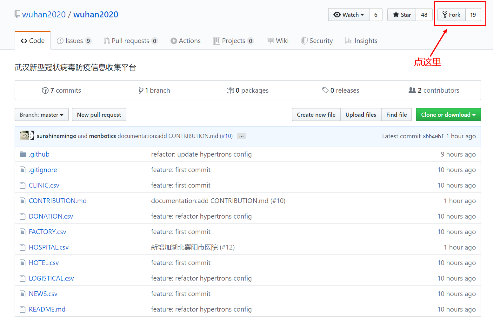
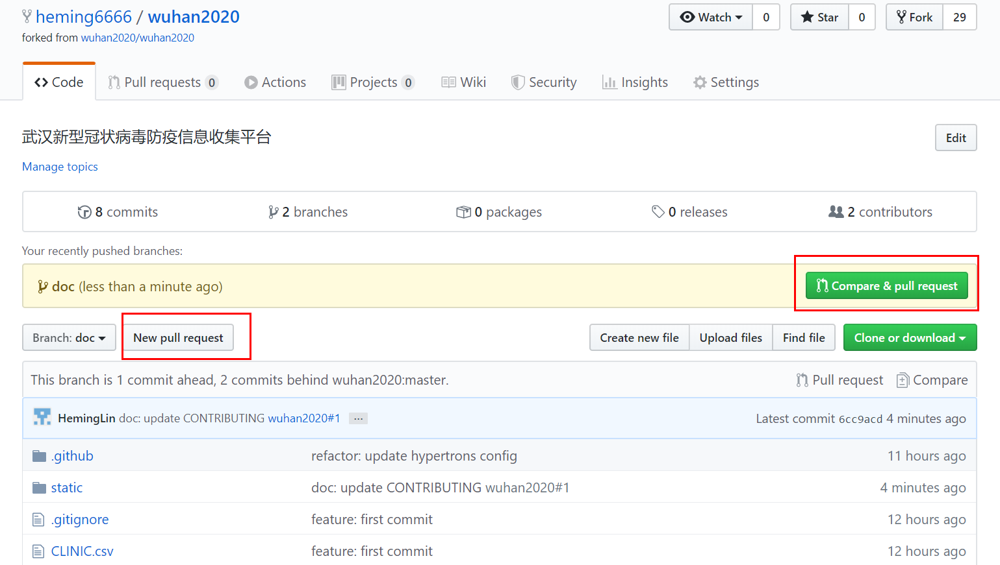
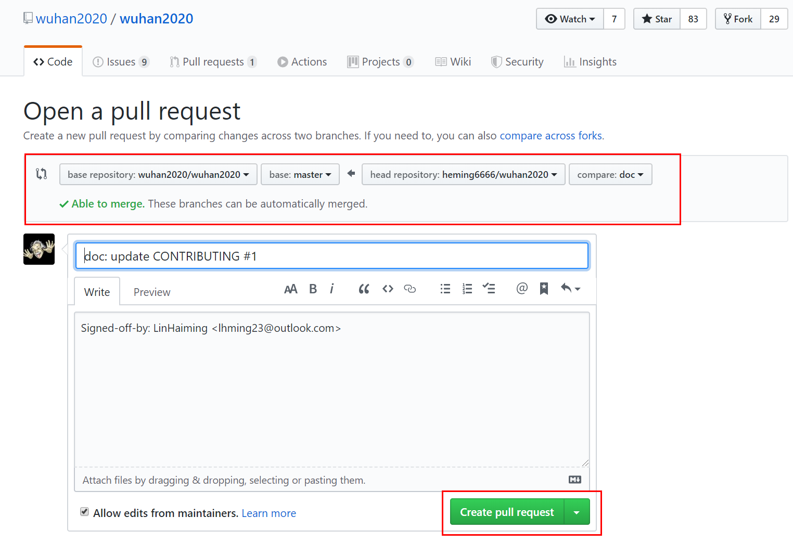

用于毕业设计的几个项目，包括

- 基于web服务的动作识别系统
- 基于树莓派的动作识别系统
- 基于机器视觉的林木识别系统
- 基于机器视觉的树木病虫害研究
- 基于机器视觉的苗木图像分割研究
- 基于机器视觉的苗木根、茎、叶分类研究
- 基于机器视觉的马尾松苗木活力研究 - quality_evaluate
- 实验设备的网络管理系统
- 基于web的掌上超市APP的设计与开发
- 基于Java EE的图书管理系统的设计与实现


github使用方法介绍

### 1、任务部署

> **我们的项目有不少是相通的，如果有需要别人帮助实现的功能，或者是问题，可以在issue中提出，issue是我们沟通问题的主要地方**

### 2、Fork 本仓库

访问 [bysj 仓库的主页](https://github.com/LeeWilli/bysj)，并 Fork 到自己的账号下。



> 注：以下内容是在命令行终端里面操作，如果没有git指令，可能需要安装 [Git](https://git-scm.com/).

如果不涉及到修改他人程序，我们可以在 master 分支进行开发修改。如果设计到别人写的模块数据可以从3开始看

### 2.1 查看状态

Git status

### 2.2 提交修改后文件到本地仓库

 git add <file1> <file2> … <fileN> (或者git add .)
  
 git commit

### 2.3 从本地仓库提交到远程仓库

git push

### 3、Clone 仓库

回到自己的 GitHub 主页，并找到刚刚 Fork 过来的 _wuhan2020_ 仓库，进入仓库主页, 将该仓库 `clone` 到本地，如：

```bash
# 将下面的 XXX 替换成你自己的用户名
git clone git@github.com:XXX/wuhan2020.git
cd wuhan2020
```

### 4、新建 `branch`

> 非紧急修复，不建议在 master 分支进行开发修改。

根据该分支的用途，起一个恰当的分支名称，新建分支，如：

```bash
git checkout -b my-fix-branch master
```

### 5、修改内容，并提交

对相应文件做出修改，修改完成后，提交：

```bash
git add .
git commit -m "hotel: update HOTEL.csv, fix #1"
```

提交时，尽量：

(1) 用一句话清楚的描述这次提交做了什么。

(2) 关联相关 `issue`，如 `fix #1` 、`close #2`、`#3`

如果 `commit` 之后，又做了修改，可以使用 `--amend` 参数：

```bash
git add .
git commit --amend -sm "hotel: update HOTEL.csv, fix #1"
```

### 6、同步上游仓库变更

同步上游仓库变更(即 [bysj/bysj](https://github.com/LeeWilli/bysj) )，因为可能有其他人先于你提交到上游仓库，防止冲突：

```bash
$ git remote add upstream git@github.com:bysj/bysj.git
$ git fetch upstream
```

若上游仓库有变更，需要先进行 `rebase`:

```bash
$ git rebase upstream/master
```

### 7、推送新分支到自己的远程仓库

```bash
$ git push -f origin my-fix-branch:my-fix-branch
```

### 8、提 `Pull Request`

在自己仓库的页面上提`pull request` 到上游仓库。如下图所示。




如果其他人 `review` 之后，需要再进行更改，就修改相关内容，然后执行以下操作，该 PR 将会自动同步该 `commit` 。

```bash
git add .
git commit --amend
git push -f origin my-fix-branch
```

### 9、如果你的代码合并时出现冲突时，你可以：

> 注：如果未出现冲突，则无需进行以下操作

-   先同步上游仓库变更

```bash
git fetch upstream
```

-   进行`rebase`:

```bash
git rebase upstream/master
```

-   手动解决冲突内容，之后重新提交：

```bash
git add my-fix-file
git rebase --continue
git push -f origin my-fix-branch
```

### 10、当你的代码被合并进去以后，你可以：

-   切回到 `master` 分支：

```bash
git checkout master -f
```

-   保持本地 `master` 分支与上游分支同步：

```bash
git pull --ff upstream master
```

-   删除本地分支(可选):

```bash
git branch -D my-fix-branch
```

-   删除远程分支(可选)：

```bash
git push origin --delete my-fix-branch
```

## 项目机器人说明

可以考虑建立 Github 机器人：`Menbotics`，该机器人预计可以实现：

-   **`Issue` 自动打标签**：具体见 [0、提交 issue](#0提交-issue)
-   **任务认领**：具体见 [1、认领任务](#1认领任务)
-   **代码自动合并**：有 PR(Pull Request) 提交上来之后，有代码合并权限的人员使用 `/approve` 让机器人自动合入代码。


## Slack 交流群组

可以考虑建立 [Slack 交流群组]
